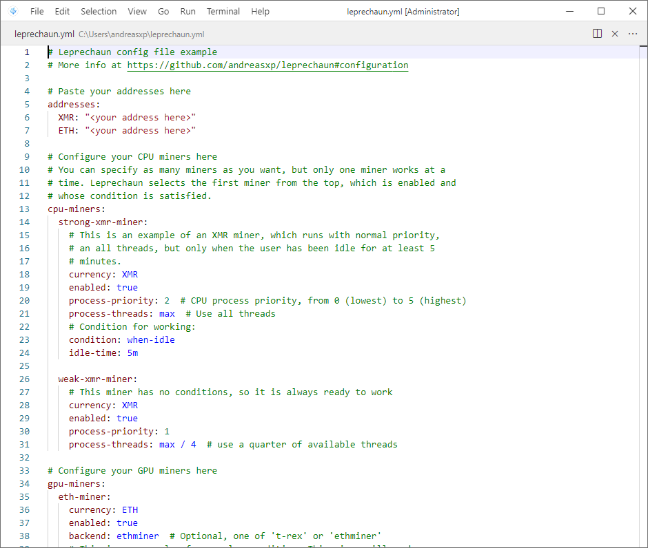
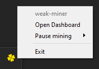
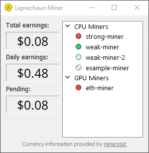

Getting Started
========================================================================================================================
System requirements: Windows 10 or higher, 64 bit. Work is underway to make Leprechaun crossplatform in the future.

Installation
------------------------------------------------------------------------------------------------------------------------
Leprechaun does not provide an installer. Instead, you can run the automatic install script in your PowerShell command
line by copying and pasting this line:

.. important::
  Always verify the security and contents of any script from the internet you are not familiar with!
  We know that this code does nothing malicious, but do you trust us? Open
  `install-leprechaun.ps1 <https://github.com/andreasxp/leprechaun/releases/download/0.5.2/install-leprechaun.ps1>`_
  and inspect it for yourself.

.. code:: PowerShell

  iex (iwr https://github.com/andreasxp/leprechaun/releases/download/0.5.2/install-leprechaun.ps1)

The install script will ask you a couple questions. In particular, we recommend answering "Yes" to adding a Windows
Security exception. Otherwise you will have to manually approve every miner executable, as Windows considers mining
crypto a malicious activity.

After installation completes, launch Leprechaun by either clicking on the shortcut or finding it in Windows Search.

First Launch
------------------------------------------------------------------------------------------------------------------------
When first launched, Leprechaun will create a sample configuration file for you, called :code:`leprechaun.yml`. This
file will be located in your home directory, such as :code:`C:\Users\User\leprechaun.yml`. It controls all aspects of
your configuration, but is very simple to write.

You will recieve a pop-up window inviting you to customize this file to your liking. Open the config file using the
included editor. You will see something like this:

The comments in this template will provide a good starting point for customization. Visit the :doc:`configuration page
<configuration>` for a deeper dive into all the options. This config file is also available on that page.

.. note::
  Keep in mind that Leprechaun does not hold your funds for you. While this gives you more control over your money,
  it also means you will have to create your own wallets for all the currencies you mine. Google your currency name
  to find a good wallet.

When you complete your config file and press "Continue", the welcome pop-up will close and a yellow cloverleaf will
appear in your system tray. Leprechaun is now ready and working.

To find out what Leprechaun is doing, right-click this icon.

The Dashboard
------------------------------------------------------------------------------------------------------------------------

        "CPU Miners" and "GPU Miners"

After clicking the system tray icon, you will see a quick actions menu. The top row displays current status of
Leprechaun, such as currently running miners.

Mining can be paused for 5 minutes, 20 minutes, 1 hour or 8 hours, in case it interferes with whatever you are currently
doing. It can be resumed manually before the time is up from the same menu. If you find yourself frequently pausing
mining, you might want to adjust the miner properties or conditions. For example, XMR miner can be limited to just half
your cpu or lower, so that it does not interfere with your work.

The "Open Dashboard" button will open the dashboard, where you can view in detail what is going on with your miners.

On the left you will find three displays, showing your total earnings using all miners, your daily revenue, adjusted for
pool and backend fees, and your pending balance (which is usually kept by the pool in order to save on transfer fees).

On the right, you will see all your miners and their status:

.. |status-ready| image:: ../../leprechaun/data/icons/status-ready.svg
  :width: 24em

.. list-table::
  :width: 1000
  :widths: 10 90

  * - |status-running|
    - Running right now.
  * - |status-ready|
    - Ready to run.
  * - |status-not-allowed|
    - Not allowed because a condition is not fulfilled.
  * - |status-paused|
    - Paused.
  * - |status-disabled|
    - Disabled in the config file.
  * - |status-broken|
    - Crashed. Restart Leprechaun to try running it again.